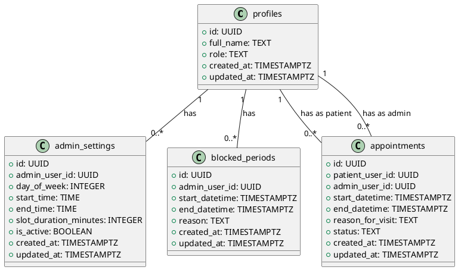
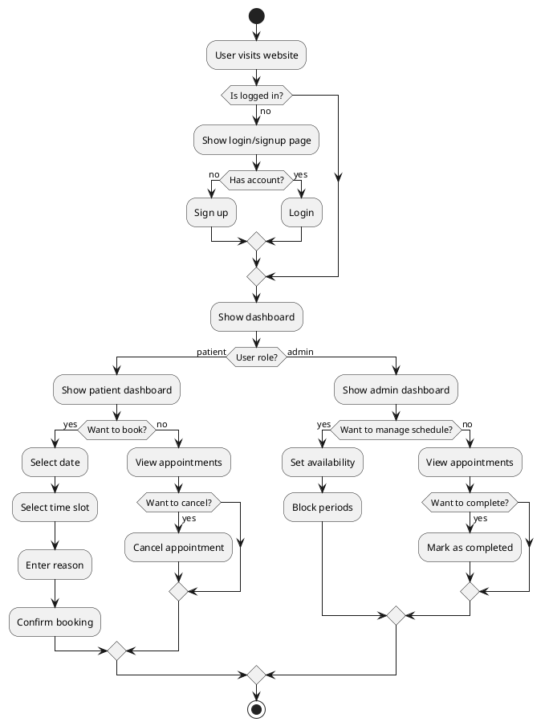
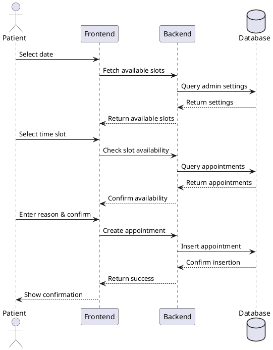
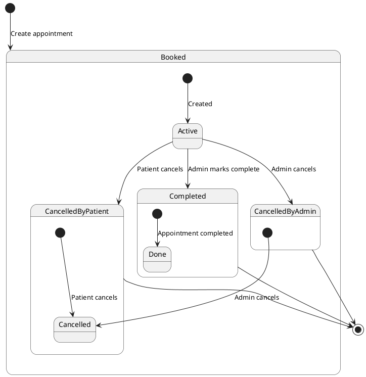

# UML Diagrams for Doctor Booking System

## Class Diagram (Database Schema)

## Activity Diagram (Application Flow)

## Sequence Diagram (Booking Process)

## State Machine Diagram (Appointment States)

## How to Use These Diagrams

1. Install PlantUML extension in your IDE or use an online PlantUML editor
2. Copy the diagram code you want to view
3. Paste it into the PlantUML editor
4. The diagram will be generated automatically

Note: These diagrams are generated using PlantUML syntax. You can modify them by editing the code blocks above.
